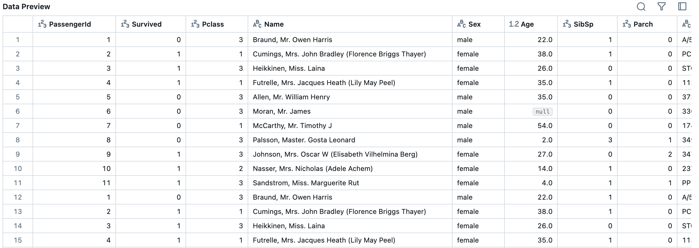

Check CI/CD Status: [](https://github.com/nogibjj/kim_seijung_project6_mysql/actions/workflows/cicd.yml)

# Mini-project #6
#### Repo Title: Complex SQL Query for a MySQL Database
#### Author: Seijung Kim (sk591)

## Overview
This project demonstrates loading extracted data into the Databricks SQL Warehouse and performing complex queries. It executes ETL (Extract, Transform, Load), which is a data pipeline process that takes raw data, transforms it for analysis, and loads it into a database or analytics tool. The pipeline also performs queries such as joining tables, aggregating data, and sorting data with connection to Databricks.

## Requirements
* Design a complex SQL query involving joins, aggregation, and sorting
* Provide an explanation for what the query is doing and the expected results

Criteria: 
* Query functionality
* Explanation and documentation
* CI/CD pipeline 
* README.md

## Contents of the Project
The project includes the files below:

* `Makefile` (with install, format, lint, test, all)
* `requirements.txt`
* `.devcontainer` (with `.devcontainer.json` and `Dockerfile`)
* `.github/workflows` for GitHub Actions (with the Matrix Build set up for different Python versions)
* In `main.py`, we execute ETL and SQL query operations. The results of the queries a logged inside `log.md` file.
* In `test_main.py`, we check if all ETL and SQL queries have ran successfully.
* In `mylib`, there are three scripts:
`extract.py`: extracts a dataset from a URL.
`query.py`: contains functions including join, aggregation, and sorting query operations.
`transform_load.py`: loads the transformed data into a Databricks warehouse table using Python's SQL module.

## Dataset
#### Titanic Database Schema

This project uses the Titanic passenger dataset, which is commonly used in data science for practice. The following table describes the columns and data types for the `Titanic` Databricks table.

| Column       | Data Type | Description                                                        |
|--------------|------------|--------------------------------------------------------------------|
| PassengerId  | INTEGER    | Unique identifier for each passenger                              |
| Survived     | INTEGER    | Survival status (0 = No, 1 = Yes)                                 |
| Pclass       | INTEGER    | Passenger class (1 = 1st, 2 = 2nd, 3 = 3rd)                       |
| Name         | STRING     | Full name of the passenger                                        |
| Sex          | STRING     | Gender of the passenger                                           |
| Age          | DOUBLE     | Age of the passenger (in years)                                   |
| SibSp        | INTEGER    | Number of siblings or spouses aboard                              |
| Parch        | INTEGER    | Number of parents or children aboard                              |
| Ticket       | STRING     | Ticket number                                                     |
| Fare         | DOUBLE     | Fare paid by the passenger                                        |
| Cabin        | STRING     | Cabin number (if available)                                       |
| Embarked     | STRING     | Port of embarkation (C = Cherbourg, Q = Queenstown, S = Southampton) |

#### Screenshot of data in Databricks


## Written Explanation of the Queries

There are three SQL queries in this project:

1. Joining Tables: This query joins the Titanic dataset with a Ports table based on the embarkation port's code (Embarked), providing detailed information on the port from which each passenger embarked. The Embarked field in the Titanic table represents the port code (C, Q, or S) where passengers boarded the ship, while the Ports table contains additional information like the full port name (PortName) and the corresponding country (Country). 
```
    SELECT 
        t.PassengerId, t.Name, t.Sex, t.Age, t.Embarked, 
        p.PortName, p.Country
    FROM default.Titanic t
    JOIN default.Ports p 
    ON t.Embarked = p.PortCode;
```
* The query uses an INNER JOIN based on the common column Embarked from the Titanic dataset and PortCode from the Ports table. Only rows with matching port codes in both tables are included.
* The output of this query would include columns like PassengerId, Name, Sex, Age, Embarked, PortName, and Country. The query combines passenger details with information about the port from which they embarked.

2. Aggregating Data: This query calculates the average age of passengers, grouped by their passenger class (Pclass). It helps in understanding the age distribution across different classes on the Titanic. Passenger classes represent socio-economic status, with 1st class being the highest and 3rd class being the lowest.
```
    SELECT Pclass, AVG(Age) AS AverageAge
    FROM default.Titanic
    GROUP BY Pclass;
```
* The query groups the dataset by the Pclass column using the GROUP BY clause and then calculates the average of the Age column for each class using the AVG function.
* The output of this query would include columns Pclass and AverageAge. It shows the average age for passengers in each of the three classes (1st, 2nd, and 3rd).

3. Sorting Data: This query sorts the Titanic dataset by Fare in descending order, allowing you to identify passengers who paid the highest fares. Sorting by fare can reveal the range of ticket prices and identify wealthier passengers or those with the most luxurious accommodations.
```
    SELECT PassengerId, Name, Fare
    FROM default.Titanic
    ORDER BY Fare DESC;
```
* The query uses the ORDER BY clause with the Fare column, specifying DESC to sort the fares from highest to lowest.
* The output of this query would include columns like PassengerId, Name, and Fare, sorted by the Fare column in descending order. The top rows would show the passengers who paid the highest fares.

